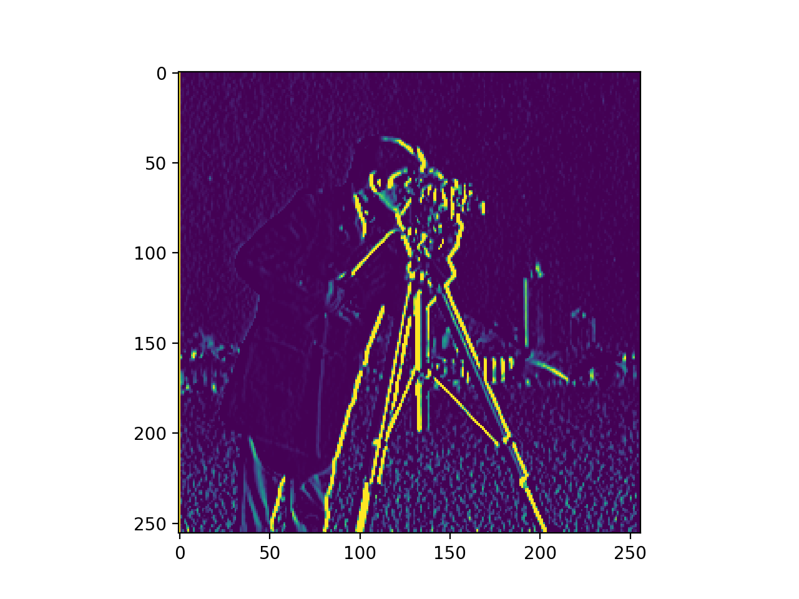
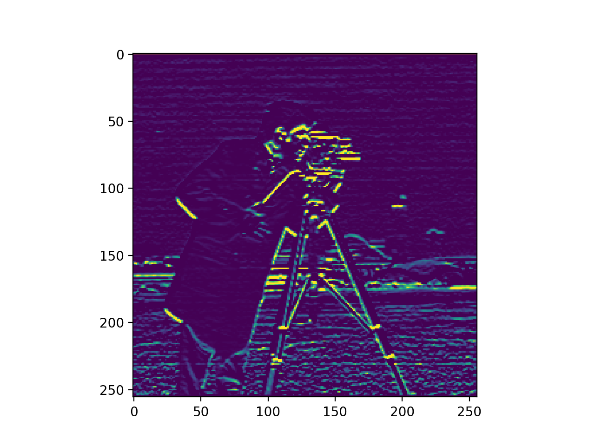
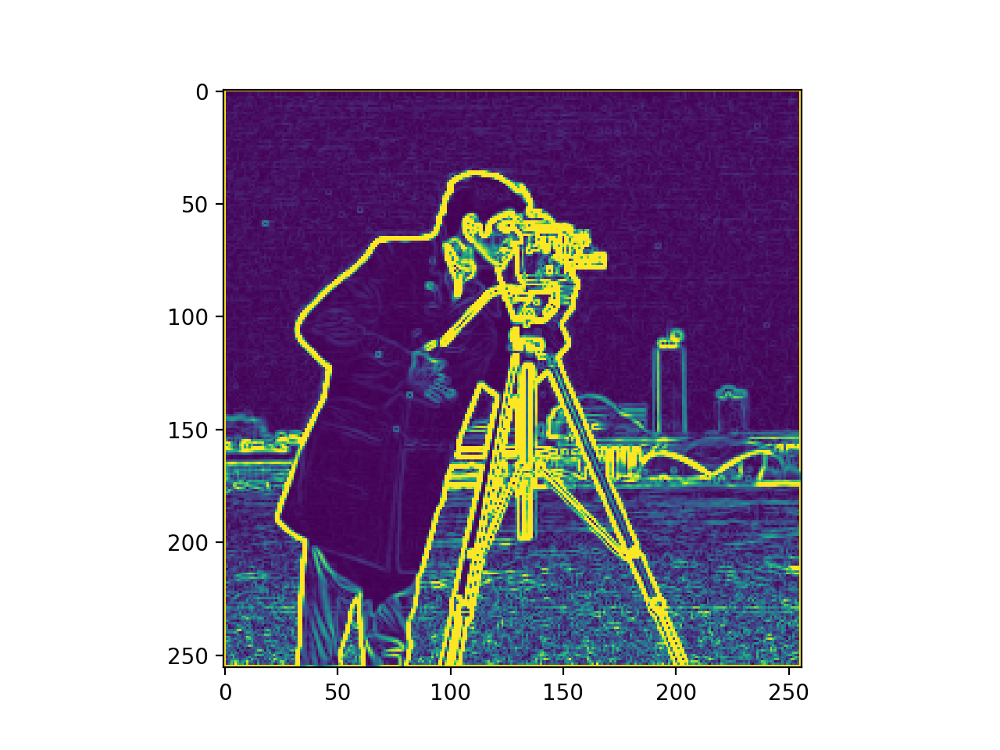
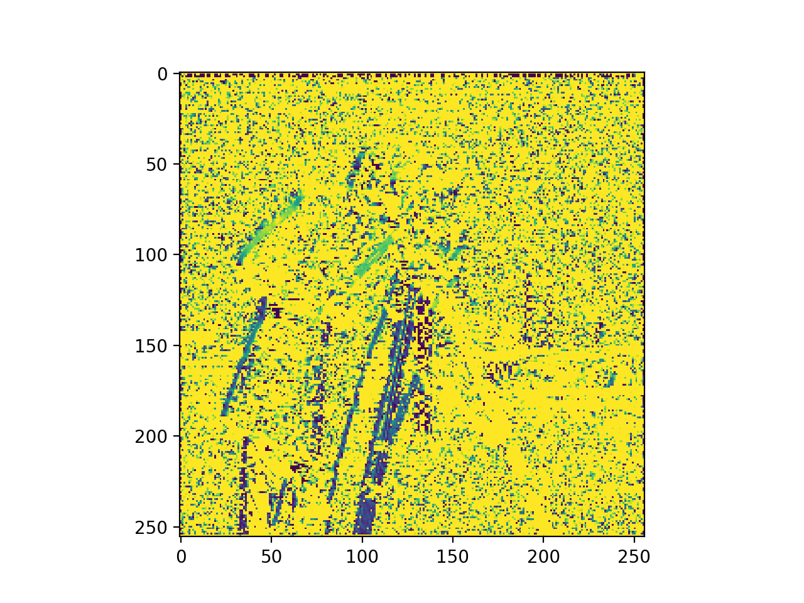
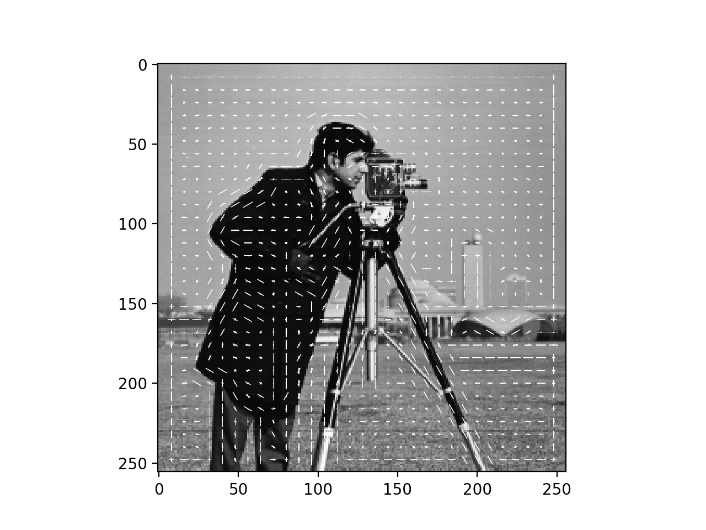
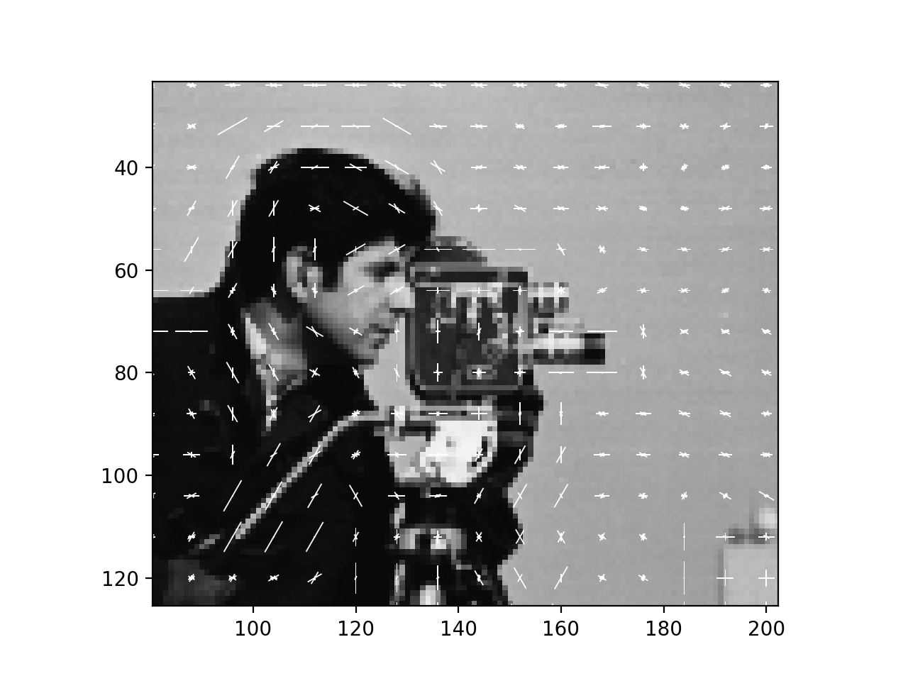
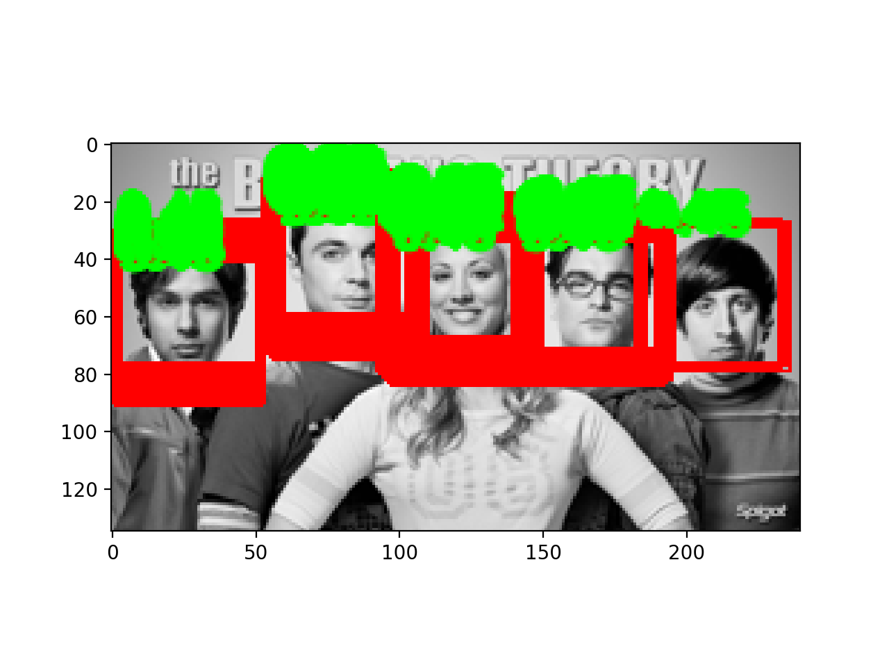
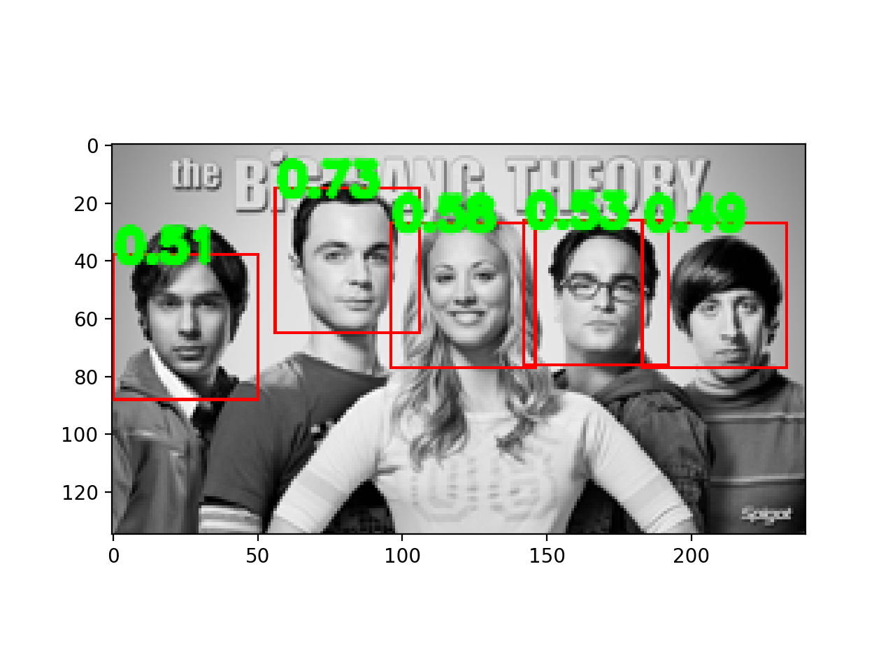

# Assignment #1

Yifan Zhang

##HOG

The **HOG** is implemented by following functions:

* **get_differential_filter():** returns Sobel filter along **x** and **y** axis
* **filter_image(im, filter):** takes an image **im** and returns its filtered image
* **get_gradient(im_dx, im_dy):** takes the filtered image along **x** and **y** axis and returns its gradient magnitude and angle

* **build_histogram(grad_mag, grad_angle, cell_size):** takes the gradient magnitude and angle of an image, **cell_size = 8**, and returns its oriented histogram
* **get_block_descriptor(ori_histo, block_size):** takes the oriented histogram of an image, **block_size =2**, and returns the normalized block histogram

  

## 2.5 Face Detection

* **face_recognition(I_target, I_template):** takes a target image and a template image to detect the faces in the target image
* The first image is the target image after **thresholding**; the second image is the result of the face detection

